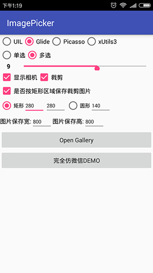
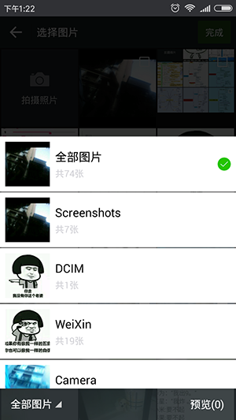

# ImagePicker  
 
 
 
 
 
## apk
[ImagePicker-1.0.1-sample.apk](https://github.com/Sing1/ImagePicker/blob/master/app/app.apk)
## gradle:
```groovy
dependencies {
    ...
    compile 'sing.imagepicker:library:1.0.2'
}
```
## Maven:
```xml
<dependency>
  <groupId>sing.imagepicker</groupId>
  <artifactId>library</artifactId>
  <version>1.0.2</version>
  <type>pom</type>
</dependency>
```
## sample 
```JAVA    
 未提交审核，暂不可使用，如需急用，可下载源码
```
